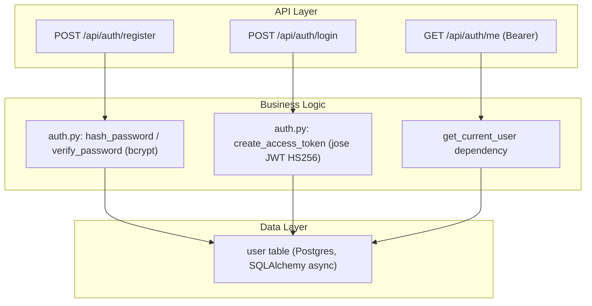
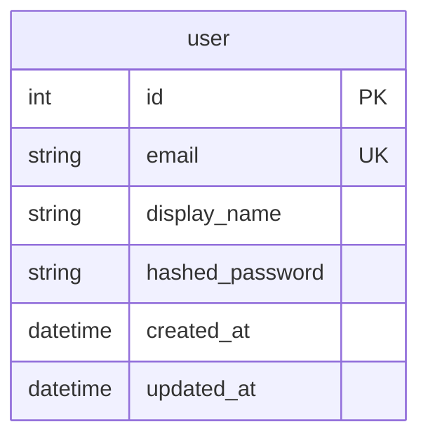

# Implementation Plan: Authentication

## Goal
Provide JWT-based auth (register/login/me) with bcrypt password hashing, mirroring the proven pattern in `temps/backend/app/auth.py` and `routers/auth.py`. Modular FastAPI structure keeps auth isolated and unit-testable.

## Requirements
- `POST /api/auth/register` → 201 token+user
- `POST /api/auth/login` → 200 token+user
- `GET /api/auth/me` → current user
- Dependency `get_current_user` reused by all protected routers

## Technical Considerations

### System Architecture Overview

- **Stack choice**: `bcrypt` (industry standard), `python-jose[cryptography]` (matching reference), FastAPI `HTTPBearer` security.
- **Integration**: routers import `get_current_user` from `app.auth`; token TTL 7 days via `ACCESS_TOKEN_EXPIRE_MINUTES`.

### Database Schema Design

- `email` unique + indexed; `hashed_password` never plaintext.

### API Design
| Method | Path | Auth | Body | Response |
|---|---|---|---|---|
| POST | /api/auth/register | – | `{email, display_name, password}` | `{access_token, user}` (201) |
| POST | /api/auth/login | – | `{email, password}` | `{access_token, user}` (200) |
| GET | /api/auth/me | Bearer | – | `{id, email, display_name, created_at}` |

Errors: 400 duplicate email, 401 invalid credentials/token, 422 validation (pydantic).

### Security & Performance
- bcrypt salt auto-generated; JWT `sub` = user id; token validated on every protected route.
- No password logging; pydantic `EmailStr` validation (email-validator).

## Key Files
- `backend/app/auth.py`, `backend/app/routers/auth.py`, `backend/app/schemas.py` (UserRegister/UserLogin/UserResponse/TokenResponse)
- `backend/tests/test_auth.py`
