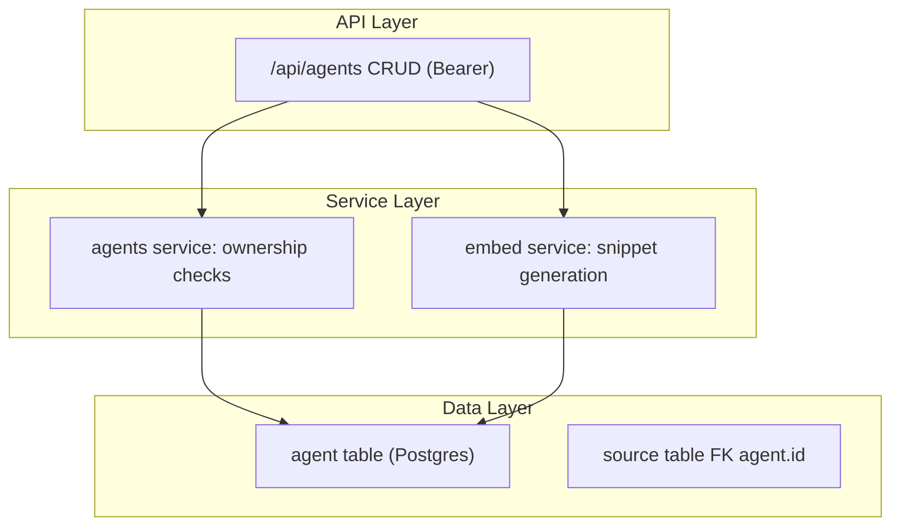
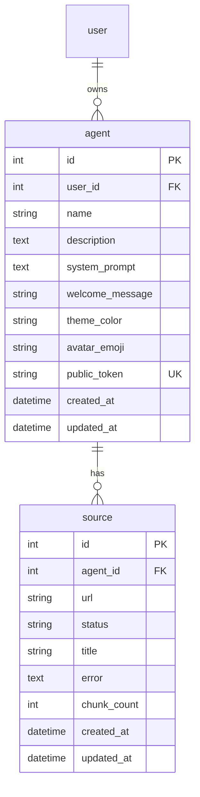

# Implementation Plan: Agent Management & Personalization

## Goal
CRUD + personalization endpoints for user-scoped agents, with a generated `public_token` for widget authentication and an embed-snippet generator.

## Requirements
- Create / list / get / patch / delete agents; regenerate token; get embed snippet.
- All scoped to `user_id` (404 for foreign agents).

## Technical Considerations

### System Architecture Overview

- **Stack choice**: SQLAlchemy async + pydantic schemas; `secrets.token_urlsafe(32)` for tokens.
- **Embed snippet**: returned as HTML string pointing at `BACKEND_URL` from config.

### Database Schema Design

- `public_token` unique indexed; `user_id` FK `user.id`; delete agent cascades sources (and in-memory store).

### API Design
| Method | Path | Auth | Notes |
|---|---|---|---|
| POST | /api/agents | Bearer | create; auto public_token |
| GET | /api/agents | Bearer | list (newest first) |
| GET | /api/agents/{id} | Bearer | 404 if foreign |
| PATCH | /api/agents/{id} | Bearer | partial update |
| DELETE | /api/agents/{id} | Bearer | cascade sources + store cleanup |
| POST | /api/agents/{id}/regenerate-token | Bearer | rotate token |
| GET | /api/agents/{id}/embed | Bearer | snippet HTML |

### Security & Performance
- Ownership enforced in service layer; token rotation invalidates old widget sessions (401 after rotation).

## Key Files
- `backend/app/routers/agents.py`, `backend/app/models.py` (Agent, Source), `backend/app/schemas.py`
- `backend/tests/test_agents.py`
