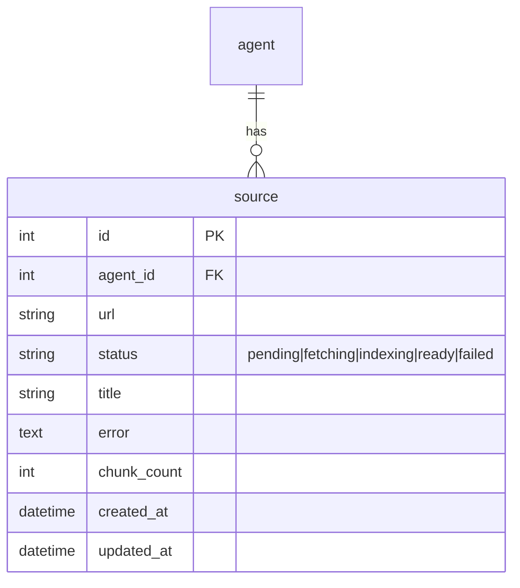

# Implementation Plan: Knowledge Base (RAG Ingestion)

## Goal
Per-agent RAG knowledge base: user pastes URLs → background pipeline fetches, parses HTML to clean text, chunks, embeds (OpenRouter), stores in a per-agent `InMemoryVectorStore` with `{url, title}` metadata. Index rebuilt on startup.

## Requirements
- Source CRUD endpoints with live status (pending/fetching/indexing/ready/failed).
- Pipeline per URL; batch embeddings (≤100/request); dedupe URLs.
- `RAGStoreManager`: `agent_id → InMemoryVectorStore`, with `rebuild_all()` on startup.

## Technical Considerations

### System Architecture Overview
```mermaid
graph TD
  subgraph API Layer
    K1["POST /sources (urls)"]
    K2["GET /sources"]
    K3["DELETE /sources/{id}"]
    K4["POST /sources/reindex"]
  end
  subgraph Service Layer (rag/)
    F1["fetcher.py: httpx fetch + BeautifulSoup parse"]
    S1["splitter.py: RecursiveCharacterTextSplitter 1000/200"]
    E1["embeddings.py: OpenRouterEmbeddings (custom Embeddings)"]
    M1["store.py: RAGStoreManager (InMemoryVectorStore per agent)"]
    P1["pipeline.py: orchestrate fetch→parse→chunk→embed→store"]
  end
  subgraph Data Layer
    D1["source table (Postgres)"]
    D2["vector_store memory (chunks w/ url+title meta)"]
  end
  subgraph External
    X1["target website (HTTP)"]
    X2["openrouter.ai /api/v1/embeddings"]
  end
  K1 --> P1 --> F1 --> X1
  F1 --> S1 --> E1 --> X2
  E1 --> M1 --> D2
  P1 --> D1
  K2 --> D1
  K3 --> M1 --> D2
```
- **Stack choice** (official docs `docs.langchain.com/oss/python/langchain/knowledge-base`):
  - `InMemoryVectorStore(embeddings)` from `langchain_core.vectorstores`.
  - `RecursiveCharacterTextSplitter(chunk_size=1000, chunk_overlap=200)`.
  - Custom `OpenRouterEmbeddings(Embeddings)` — `langchain-openrouter` exposes only `ChatOpenRouter`, so we call `POST {OPENROUTER_BASE_URL}/embeddings` via httpx exactly as documented in the user's reference snippet.
  - `BeautifulSoup` (bs4) for HTML parsing; strip `script, style, noscript, nav, header, footer, iframe, svg`.
- **Integration Points**: source table drives status; store manager holds runtime state; `RAGStoreManager.reset()` on agent delete; `rebuild_all()` in FastAPI lifespan background task.

### Database Schema Design

- Index: `(agent_id, url)` unique; `status` indexed for polling queries.

### API Design
| Method | Path | Auth | Body/Query | Behavior |
|---|---|---|---|---|
| POST | /api/agents/{id}/sources | Bearer | `{urls:[...]}` | create pending (dedupe), spawn pipeline task |
| GET | /api/agents/{id}/sources | Bearer | – | list + status |
| DELETE | /api/agents/{id}/sources/{sid} | Bearer | – | delete row + store.delete (by source_id meta) |
| POST | /api/agents/{id}/sources/reindex | Bearer | `{only_failed?: bool}` | re-run pipeline for selected sources |

### Security & Performance
- SSRF guard (MVP): reject non-http(s) URLs; resolve and allow only public hosts (basic allowlist-free validation + timeout 15s).
- Batch embeddings (≤100); sequential per-URL tasks within an agent (avoid hammering target sites).
- Failure isolation: per-URL try/except → status failed + error string.

## Key Files
- `backend/app/rag/embeddings.py`, `fetcher.py`, `splitter.py`, `store.py`, `pipeline.py`
- `backend/app/routers/knowledge.py`
- `backend/tests/test_fetcher.py`, `test_store.py`, `test_pipeline.py`

## Retrieval format (tool contract, used by chat feature)
`search_knowledge_base(query)` returns, per chunk:
```
[Source: {url} | {title}]
{content}
```
plus a header line with count; empty result → explicit "no relevant content found" note.
