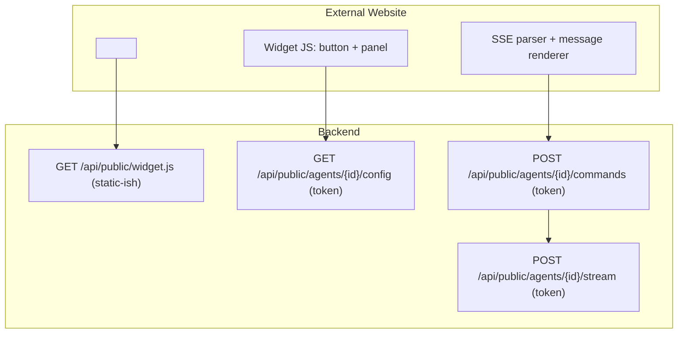

# Implementation Plan: Embeddable Widget

## Goal
A dependency-free widget script (`/api/public/widget.js`) that turns an agent into a floating bottom-right chat bot on any external website, using `data-agent-id` + `data-token` from the embed snippet for identification/authentication, streaming via SSE.

## Requirements
- `GET /api/agents/{id}/embed` (auth) → snippet HTML.
- `GET /api/public/widget.js` → pure JS (no build, no imports).
- Widget: bootstrap config → render button+panel → chat over public SSE endpoints.

## Technical Considerations

### System Architecture Overview

- **Widget structure** (single file, ~300 lines): an IIFE that:
  1. Finds its own `<script>` tag via `document.currentScript` (fallback: last script with data-attrs).
  2. `GET config` → `{name, welcome_message, theme_color, avatar_emoji, description}`.
  3. Builds shadow-DOM-free scoped UI (prefix `apw-`): floating button, panel (header/msg list/input), CSS injected into `<style>` tag.
  4. Session: `sessionStorage["apw_thread_" + agentId]`, thread id `crypto.randomUUID()`.
  5. Chat: send via `fetch POST commands` `run.start`, then `fetch POST stream` with `ReadableStream` SSE parse (split on `\n\n`, parse `event:`/`data:`), render `text_delta`; show "Searching knowledge base…" on `tool_start`; render `[Source: url]` links on `tool_end`/message content; end on `message_end`/lifecycle.
  6. Keyboard: Enter send, Shift+Enter newline; Escape/close button closes panel.
  7. Error state: retry button when lifecycle=failed or fetch fails.
- **Config injection**: widget needs `base_url` — read from `data-base-url` (set by embed snippet) defaulting to the script's own origin.
- **CSP**: no inline event handlers (`addEventListener` only); own styles only.

## API Design
| Method | Path | Auth | Notes |
|---|---|---|---|
| GET | /api/agents/{id}/embed | Bearer | returns HTML snippet string |
| GET | /api/public/widget.js | – | JS content-type `application/javascript` |
| GET | /api/public/agents/{id}/config | X-Agent-Token | public bootstrap |
| POST | /api/public/agents/{id}/commands | X-Agent-Token | run.start/cancel |
| POST | /api/public/agents/{id}/stream | X-Agent-Token | SSE |

## Security & Performance
- Token validated server-side on every call; no agent data exposed without token.
- Widget cached (Cache-Control) on config-less endpoints; config fetched once per page load.

## Key Files
- `backend/app/widget/widget.js` (template string served by `routers/public.py` or static file)
- `backend/app/services/embed.py` (snippet builder)
- `backend/tests/test_embed.py`, `test_widget_contract.py`
- `frontend/public/demo.html` (demo page)
