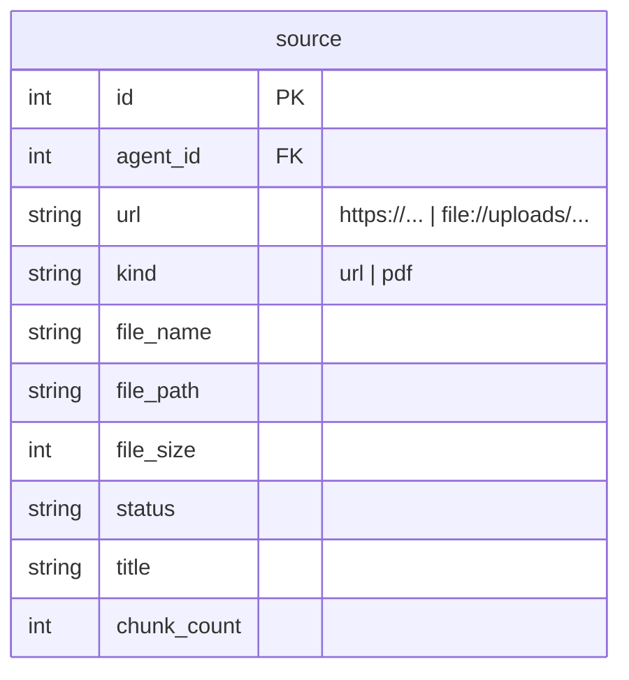

# Implementation Plan: PDF Upload for Knowledge Base

## Goal
Extend the RAG ingestion pipeline with local PDF files while keeping one unified `source` model and one indexing pipeline.

## Technical Considerations

### System Architecture Overview
```mermaid
graph TD
  subgraph API Layer
    F1["POST /api/agents/{id}/sources/files (multipart)"]
  end
  subgraph Storage
    D1["source table (kind=pdf, file_name, file_path)"]
    FS1["backend/uploads/{agent_id}/{uuid}.pdf"]
  end
  subgraph Pipeline (rag/)
    P1["index_source: kind=url → fetch_page | kind=pdf → parse_pdf"]
    P2["split_text → OpenRouterEmbeddings → RAGStoreManager"]
  end
  F1 -->|save + insert| D1
  F1 -->|write bytes| FS1
  D1 --> P1 --> FS1
  P1 --> P2
```
- **Stack choice** (official docs: `docs.langchain.com/oss/python/langchain/knowledge-base` uses `pypdf`): add `pypdf`; `parse_pdf(path)` extracts text per page, joined with `\n\n`.
- **File naming**: `{uuid4().hex}.pdf` under `uploads/{agent_id}/` → `url` column = `file://{rel_path}` (satisfies unique constraint + serves as identifier).
- **Migration**: idempotent `ALTER TABLE source ADD COLUMN IF NOT EXISTS kind/file_name/file_size/file_path` in `init_db()`.

### Database Schema Changes


### API Design
| Method | Path | Auth | Body | Behavior |
|---|---|---|---|---|
| POST | /api/agents/{id}/sources/files | Bearer | multipart `files` (1..5 PDFs) | validate → save → insert kind=pdf → index → return sources |

Validation: filename ends `.pdf` (case-insensitive), size ≤ 10MB, count ≤ 5 → else 422.

### Key Files
- `backend/app/rag/pdf.py` (parse_pdf), `rag/pipeline.py` (branch on kind), `routers/knowledge.py` (files endpoint), `models.py`, `schemas.py`, `config.py` (UPLOAD_DIR), `database.py` (ALTERs)
- `frontend/src/api/client.ts` (uploadSourceFiles), `api/types.ts`, `components/KnowledgeTab.vue` (upload zone + PDF badge)
- Tests: `backend/tests/test_pdf.py`, `test_knowledge.py` (upload API), `frontend/src/api/__tests__/client.spec.ts`
