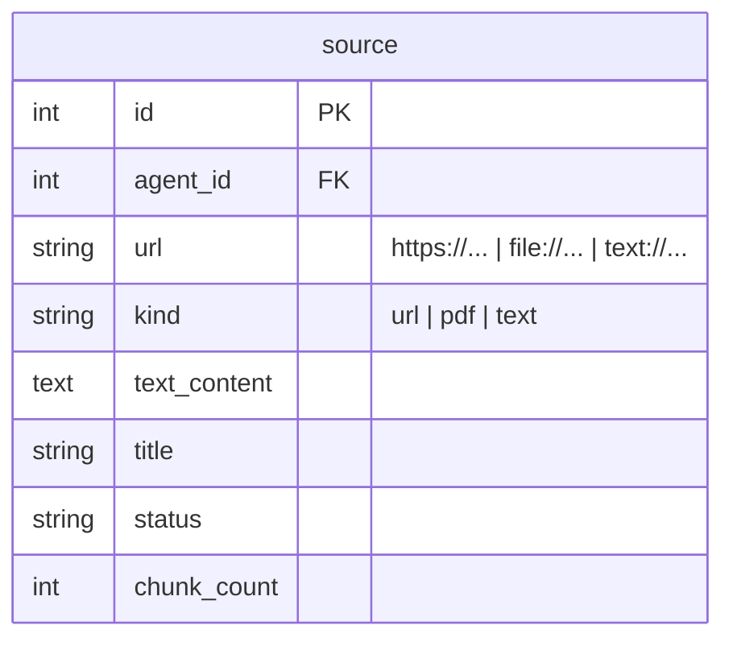

# Implementation Plan: Long Text as Knowledge Source

## Goal
Add a third source kind `text` that stores pasted long-form content directly in Postgres, flowing through the exact same chunk/embed/index pipeline as URLs and PDFs.

## Technical Considerations

### System Architecture Overview
```mermaid
graph TD
  subgraph API Layer
    T1["POST /api/agents/{id}/sources/text {title?, content}"]
  end
  subgraph Data
    D1["source row: kind=text, url=text://{uuid}, text_content, title"]
  end
  subgraph Pipeline (rag/)
    P1["_load_source_text: kind=text → source.text_content"]
    P2["split_text → OpenRouterEmbeddings → RAGStoreManager"]
  end
  T1 --> D1
  D1 --> P1 --> P2
```
- **Storage**: `text_content TEXT` column (nullable) on `source`; `url` = `text://{uuid}` (unique per agent).
- **Migration**: `ALTER TABLE source ADD COLUMN IF NOT EXISTS text_content TEXT` in `init_db()`.
- **Citations**: marker parser + clients accept the `text://` scheme and render `📝 {title}` as a non-link label (same pattern as `file://` PDFs).

### Database Schema Change


### API Design
| Method | Path | Auth | Body | Behavior |
|---|---|---|---|---|
| POST | /api/agents/{id}/sources/text | Bearer | `{title?, content}` (10..200_000 chars) | insert kind=text → index → return source |

### Key Files
- `backend/app/models.py` (text_content), `schemas.py` (TextSourceCreate), `rag/pipeline.py` (kind=text branch), `routers/knowledge.py` (text endpoint), `services/agent_session_service.py` (text:// markers)
- `frontend/src/api/{client,types}.ts`, `utils/sse.ts` (text://), `components/KnowledgeTab.vue` (3-mode input: URLs | PDF | Text)
- Tests: `backend/tests/test_knowledge.py` (text API), `test_pipeline.py` or `test_text.py` (indexing), `test_sources.py` (text:// markers); frontend `client.spec.ts`, `sse.spec.ts`
