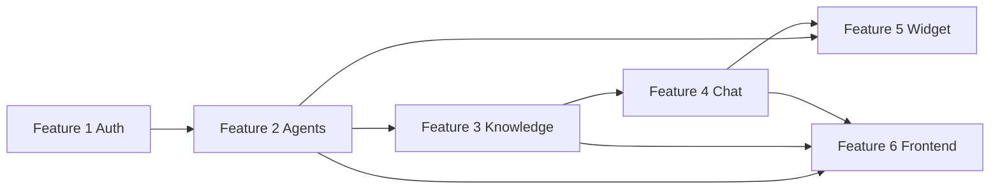

# Project Plan: Agent-Plug MVP

## Hierarchy

```
Epic: Agent-Plug MVP (L)
├── Feature 1: Authentication (P0, High)                    # auth
│   ├── Story: Register & login (2)
│   ├── Story: Session restore /me (1)
│   └── Test: Auth endpoint tests (2)
├── Feature 2: Agent Management (P0, High)                  # agents
│   ├── Story: Agent CRUD + personalization (3)
│   ├── Story: Public token + embed snippet (2)
│   └── Test: Agent ownership & token tests (2)
├── Feature 3: Knowledge Base RAG (P0, High)                # knowledge
│   ├── Enabler: RAG infra (embeddings, splitter, store manager) (5)
│   ├── Story: URL ingestion pipeline (fetch/parse/chunk/embed) (5)
│   ├── Story: Sources list/status/delete/reindex (3)
│   └── Test: Fetcher/store/pipeline unit tests (3)
├── Feature 4: Agent Chat SSE (P0, High)                    # chat
│   ├── Enabler: Agent builder + checkpointer + session service (5)
│   ├── Story: Authenticated chat (preview) (3)
│   ├── Story: Public token-authenticated chat (3)
│   └── Test: Session & tool tests (3)
├── Feature 5: Embeddable Widget (P1, High)                 # widget
│   ├── Story: widget.js floating bot + SSE chat (8)
│   ├── Story: Demo page (2)
│   └── Test: Widget contract + embed snippet tests (2)
└── Feature 6: Frontend Dashboard (P1, High)                # frontend
    ├── Enabler: App shell (router, pinia, api client) (3)
    ├── Story: Auth views (2)
    ├── Story: Dashboard + agent create (3)
    ├── Story: Configure tab (2)
    ├── Story: Knowledge tab (3)
    ├── Story: Preview chat tab (3)
    ├── Story: Embed tab (2)
    └── Test: Frontend unit tests (3)
```

## Dependencies



## Priorities & Estimates

| # | Feature | Priority | Value | Estimate (t-shirt) | Blocked by |
|---|---|---|---|---|---|
| 1 | Authentication | P0 | High | S | – |
| 2 | Agent Management | P0 | High | S | 1 |
| 3 | Knowledge Base RAG | P0 | High | M | 2 |
| 4 | Agent Chat SSE | P0 | High | M | 3 |
| 5 | Embeddable Widget | P1 | High | M | 4 |
| 6 | Frontend Dashboard | P1 | High | L | 2,3,4 |

**Total: ~L (2-3 weeks for a team; single session MVP scope).**

## Sprint Plan (single MVP sprint)

- **Goal**: End-to-end working loop — signup → create agent → add URLs → index → preview chat → embed on demo page, all tests green.
- **Sequence**: Backend features 1→2→3→4→5, then frontend 6, then end-to-end verification.

## Definition of Done (Epic)

- [ ] All backend unit tests pass (`uv run pytest`)
- [ ] All frontend unit tests pass (`bun test:unit`)
- [ ] Frontend type-check + build pass (`bun run type-check`, `bun run build`)
- [ ] Manual end-to-end flow verified (register → agent → sources → chat → embed → demo)
- [ ] AGENTS.md updated in backend/ and frontend/
